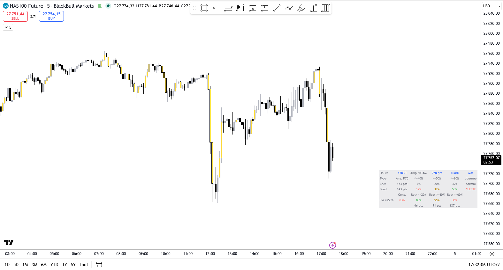

# JCO Directional Day



Indicateur TradingView Pine Script v6 d'évaluation du **risque directionnel intra-session** sur NQ Futures (Nasdaq 100), pour le scalp contrarien.

À trois timings de la session NY AM (16h00, 16h30, 17h00 Paris), il mesure l'amplitude partielle réalisée depuis 15h30 et la croise avec les statistiques historiques NQ 2023–2026 pour estimer la probabilité que la journée devienne unilatérale, pondérée par le **jour de la semaine** et le **mois courant**.

À 17h30, capture l'amplitude finale NY AM et affiche les statistiques de la session PM (continuation + retracement) selon le bucket CAT1A déterminé par le label pondéré.

Inclut également un greffon **FVG (Fair Value Gap)** qui repeint en jaune les bougies au centre d'un gap, avec filtre configurable sur la taille minimum.

---

## Principe

Le risque principal du scalp contrarien est la journée **unilatérale** : marché qui part dans un sens sans offrir de contrepartie, laissant le scalper bloqué à contresens. Plutôt que d'attendre 17h30 pour constater le verdict, l'indicateur exploite l'amplitude partielle déjà développée pour anticiper le risque dès 16h00.

À chaque timing :

1. **Mesure** : amplitude `high - low` accumulée depuis 15h30 (avant l'ouverture de la bougie courante)
2. **Lookup** : tranche d'amplitude → P75 attendue + 3 probabilités de session unilatérale (CAT1A ≤40%, ≤50%, ≤60%) + label de risque
3. **Pondération** : les 3 probabilités sont ajustées par les taux jour-de-semaine et mois via combinaison **log-odds** (additive sur les logits)

Le dashboard affiche en parallèle les valeurs **brutes** (statistiques source) et **pondérées** (ajustées au contexte calendaire), permettant de voir d'un coup d'œil l'effet du jour/mois.

---

## Méthode de pondération (log-odds)

```
logit(p) = ln(p / (1-p))

Δ_jour  = logit(taux_jour)  - logit(taux_global)
Δ_mois  = logit(taux_mois)  - logit(taux_global)

logit(p_pondéré) = logit(p_base) + Δ_jour + Δ_mois
p_pondéré = 1 / (1 + exp(-logit(p_pondéré)))
```

**Avantages** : reste borné dans `[0,1]`, traite symétriquement hausse/baisse de risque, additif sur les logits.

**Limites** :
- Indépendance jour × mois supposée (non vérifiée dans les données)
- Pas de stat mensuelle pour ≤60% : extrapolation via `mon_le50 × (GLOBAL_LE60 / GLOBAL_LE50) ≈ × 1.7`

---

## Dashboard (bas à droite, au-dessus du dashboard NY Amplitude Levels)

```
Heure   │ 16h30  │ Amp NY AM │ 80 pts  │ Vendredi │ Mai
Type    │ Amp P75│  <=40%    │ <=50%   │ <=60%    │ Journée
Brut    │ 158pts │   7%      │  17%    │  35%     │ attention
Pond.   │ 158pts │  11%      │  28%    │  50%     │ ALERTE
        │ Cont.  │ Retr ≥20% │ Retr≥40%│ Retr≥60% │              ← mini-header (à partir de 17h30)
PM ≤50% │  83%   │   80%     │   55%   │   35%    │              ← bucket sélectionné + probas Section 3
        │        │   30 pts  │  60 pts │  90 pts  │              ← amplitudes correspondantes
```

| Ligne          | Contenu                                                                       |
|----------------|-------------------------------------------------------------------------------|
| Contexte       | Heure du snapshot, amplitude NY AM mesurée, jour, mois (en bleu)              |
| En-tête        | Libellés des colonnes (AM)                                                    |
| Brut           | Données source du PDF, en gris                                                |
| Pondéré        | Probabilités ajustées au contexte calendaire, colorées par seuil              |
| Mini-header PM | Libellés des colonnes (PM), affichés à partir de 17h30                        |
| Probas PM      | Continuation et retracement Section 3, selon bucket CAT1A déterminé par Pond. |
| Amp PM         | Amplitudes en pts correspondant aux retracements (% × amp NY AM finale)       |

**Code couleur ligne pondérée** :
- ≤40% en **rouge** (le pire scénario directionnel)
- ≤50% en **gold** (intermédiaire)
- ≤60% en **vert** (le seuil le plus permissif)
- Label en vert / gold / rouge selon sévérité

**Code couleur lignes PM** :
- Continuation : > 80% **rouge**, 70–80% **gold**, < 70% **vert** (haute = mauvaise nouvelle pour scalper bloqué à contresens)
- Retracement : < 40% **rouge**, 40–60% **gold**, > 60% **vert** (haute = bonne nouvelle, fenêtre de sortie)

**Mapping label pondéré → bucket Section 3** :

| Label pondéré         | Bucket utilisé | Continuation | Retracement disponible |
|-----------------------|----------------|--------------|------------------------|
| très calme / calme / normal | référence (non unilatéral) | 71.8% | n/a |
| attention             | ≤60%           | 82.4%        | 86 / 63 / 42% (≥20/40/60) |
| ALERTE grosse amp.    | ≤60%           | 82.4%        | 86 / 63 / 42%          |
| ALERTE                | ≤50%           | 83.0%        | 80 / 55 / 35%          |
| ALERTE extreme        | ≤40%           | 81.7%        | 75 / 52 / 38%          |

**Lecture rapide** : si la ligne pondérée est dominée par le rouge → on serre l'exposition. Si elle est verte/gold → contrarien sans contrainte particulière. À 17h30, la ligne PM dit jusqu'où on peut espérer un retracement pour sortir d'une position bloquée.

---

## Lecture du label « Journée »

| Label                | Probabilité (≤50% pondérée) | Action                                         |
|----------------------|-----------------------------|------------------------------------------------|
| très calme           | < 12%                       | scalp contrarien sans contrainte               |
| calme                | 12–16%                      | terrain habituel                               |
| normal               | 16–20%                      | terrain habituel, vigilance standard           |
| attention            | 20–27%                      | réduire la taille des positions contra        |
| ALERTE               | 27–45%                      | éviter le contrarien agressif                  |
| ALERTE grosse amp.   | (Timing 3, 200–300 pts)     | risque sur grosse amplitude même non unilatérale |
| ALERTE extreme       | ≥ 45% (ou >300 pts à 17h)   | sortir / passer en gestion défensive           |

Le label de la ligne **brut** vient de la tranche d'amplitude (cf. tableaux source du PDF). Le label de la ligne **pondérée** est dérivé de la probabilité ≤50% pondérée — il peut différer du brut quand le contexte calendaire est marqué.

---

## Source statistique

PDF *« NQ Risque directionnel et contrepartie »* (Mai 2026) :
- 856 jours analysés · NQ M5 · 2 jan. 2023 – 30 avr. 2026
- Distribution du ratio corps M5 sur la session NY AM (15h30–17h30 Paris)
- Tableaux de répartition par tranche d'amplitude partielle aux timings 16h00 / 16h30 / 17h00
- Tableaux de répartition par jour de la semaine et par mois de l'année

Toutes les valeurs en dur dans le code (arrays `t1_*`, `t2_*`, `t3_*`, `dow_*`, `month_*`) proviennent directement des tableaux du PDF.

---

## Paramètres

### Session NY AM

- **Heure debut NY AM (Paris)** : heure d'ouverture (défaut : 15)
- **Minute debut NY AM** : minute (défaut : 30)

Les trois timings de capture sont automatiquement calculés à `+30`, `+60`, `+90` minutes après l'ouverture.

### Dashboard

- **Afficher le dashboard** : afficher/masquer
- **Lignes vides en bas** : nombre de lignes transparentes ajoutées sous le dashboard pour réserver la place à un dashboard secondaire empilé au même coin (`bottom_right`). Défaut **7**, réglable de 0 à 20. Mettre à 0 si l'indicateur tourne seul.

### FVG (Fair Value Gap)

- **Afficher les bougies FVG** : on/off (défaut on)
- **Couleur du corps** : color picker (défaut jaune)
- **Ecart minimum, en points** : filtre les petits gaps (défaut 5 pts)

Pattern détecté sur trois bougies clôturées consécutives :
- **Bullish FVG** : `low[1] > high[3]` — la bougie [2] est dans un trou haussier
- **Bearish FVG** : `high[1] < low[3]` — la bougie [2] est dans un trou baissier

La bougie [2] est repeinte en jaune via `barcolor(offset=-2)`. Détection avec **2 bougies de délai** (il faut que la bougie suivante soit clôturée pour confirmer le pattern).

Note : `barcolor` colore la bougie entière (corps + mèches) car `plotcandle` ne supporte pas le paramètre `offset` en Pine v6.

---

## Installation

1. Ouvrir TradingView → Pine Script Editor
2. Coller le contenu de [`Indicator_JCO_Directional_Day_5m.pine`](Indicator_JCO_Directional_Day_5m.pine)
3. Cliquer sur **Ajouter au graphique**
4. Appliquer sur un graphique NQ Futures (CME) en **M5** (timeframe recommandé)

---

## Compatibilité

- **Symbole recommandé** : `NQ1!` / `MNQ1!` (CME Globex)
- **Timeframe recommandé** : **M5** (les snapshots sont calibrés sur l'ouverture des bougies M5 à 16h00 / 16h30 / 17h00)
- **Pine Script** : v6

---

## Limites à connaître

1. **Statistiques sur 856 jours / 40 mois** : échantillon raisonnable mais pas immense, surtout sur les seuils rares (≤40% n=74 jours, >400 pts n=8 jours).
2. **Le proxy précoce n'est pas une certitude** : un signal ALERTE donne 30–37% de probabilité ≤50%. 60–70% des journées en alerte ne deviennent pas unilatérales. *L'inverse est plus fiable* : amplitude calme à mi-session = journée très probablement banale.
3. **Indépendance jour × mois supposée** : on n'a pas la donnée croisée. La combinaison log-odds suppose que les deux effets sont additifs sur les logits — simplification raisonnable mais non vérifiée.
4. **Le contexte change** : les statistiques moyennent 3 ans. Re-vérifier la cohérence du modèle tous les 6–12 mois si le marché change de régime.

---

## Changelog

### v1.2 - 2026-05-04

- Ajout d'un greffon **FVG** (Fair Value Gap) intégré à l'indicateur :
  - Détection sur trois bougies clôturées consécutives
  - Filtre configurable sur la taille minimum du gap, en points (défaut 1 pt)
  - Repaint rétroactif de la bougie centrale en jaune via `barcolor(offset=-2)`
- Dashboard repositionné de `top_right` à `bottom_right`
- Nouveau paramètre **« Lignes vides en bas »** pour réserver la place à un dashboard secondaire empilé au même coin (typiquement *JCO NY Amplitude Levels*). Défaut 7, plage 0..20.
- Refactor du fond du dashboard : table en `bgcolor` totalement transparent, fond gris appliqué cellule par cellule uniquement sur les 7 lignes utiles, ce qui rend les lignes de padding réellement invisibles.

### v1.1 - 2026-05-04

- Snapshot supplémentaire à 17h30 : capture de l'amplitude finale NY AM
- Renommage « Amp » → « Amp NY AM » pour clarifier la mesure
- Nouveau bloc PM dans le dashboard (3 lignes affichées à partir de 17h30) :
  - Mini-header (Cont. / Retr ≥20% / ≥40% / ≥60%)
  - Probabilités Section 3 selon bucket CAT1A déterminé par le label pondéré
  - Amplitudes en pts correspondant aux retracements
- Coloration sémantique PM :
  - Continuation : haute = mauvaise (rouge)
  - Retracement : haute = bonne (vert)

### v1.0 - 2026-05-04

- Initial release
- Snapshot d'amplitude à 16h00 / 16h30 / 17h00 Paris
- Croisement avec les tables Timing 1 / 2 / 3 du PDF source
- Pondération log-odds par jour-de-semaine et mois
- Dashboard 6 colonnes × 4 lignes en haut à droite
- Label « Journée » dérivé de la probabilité ≤50% pondérée

---

## Licence

[Mozilla Public License 2.0](https://mozilla.org/MPL/2.0/)

© jcornier — [GitHub](https://github.com/jcornierfra/TradingView_Indicator_JCO_Directional_Day_5m)
